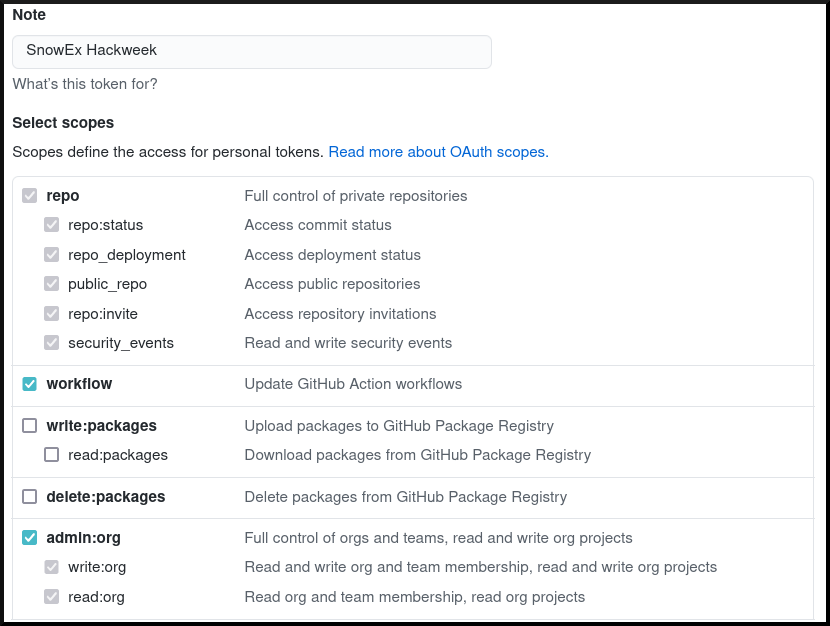

# Git

## What is Git?

[Git](https://git-scm.com/) is a popular version control system that is used in
many open source software projects to manage their software code base.

```{note}
You are not required to know Git in advance of this event, but come prepared to learn a lot about it!
[Here a quick introduction video from the official website](https://git-scm.com/video/what-is-git)
```
(setting-up-git)=
## Setting up on JupyterHub

Below are instructions to get you setup with `git` on the {{hackweek}} hackweek
JupyterHub. These are only basic instructions to get started. See the
[Software Carpentry Git](http://swcarpentry.github.io/git-novice/02-setup/index.html)
instructions for a more thorough explanation and background information.

### 1. Login to JupyterHub
Go to {{ jupyterhub_url }}. See also our JupyterHub documentation: {ref}`accessing-jupyterhub`

### 2. Open a Terminal
Choose the 'Terminal' from the 'Other' options in the 'Launcher' tab.


### 3. Configure basic `git` information
Set your username and email address. The email address should be the same
as you used to register your GitHub account.

```{attention}
Use your personal name instead of the placeholder `{{hackweek}} Attendee`
in the below commands. For the email, it should be the address you used to create
your GitHub account instead of `attendee@hackweek.com`. Both values need to be
surrounded by quotes `"`.
```

```shell
git config --global user.name "Attendee Name"
git config --global user.email "attendee@hackweek.com"
git config --global pull.rebase false
git config --global credential.helper store
```

The third line is a configuration option that needs to be done with a first time
setup. It specifies the strategy on how git will apply changes you pull from
a remote git repository. 
More on strategies is [described here.](http://git-scm.com/book/en/v2/Git-Branching-Rebasing)

The last line of the config will store your GitHub credentials and will save
you from re-entering your username and password from the command line with each
push, pull, or interactions with GitHub.

To verify that you successfully executed the above commands, use the
```shell
git config -l
```
command.

The output should look similar to this:
```shell
jovyan@jupyter:~$ git config -l
user.name= Attendee Name
user.email=attendee@hackweek.com
credential.helper=store
```

### 4. Authenticating with GitHub
In order to interact with GitHub via the `git` command inside the JupyterHub environment,
you need to set up an authentication method. One way to do this is to use your GitHub password.
However, a better, more secure practice is to use a GitHub Personal Access Token, which offers 
more customizable permissions and can be revoked without affecting your main GitHub user 
account password.

Take a moment to work through the instructions on the [GitHub personal access tokens](https://docs.github.com/en/github/authenticating-to-github/keeping-your-account-and-data-secure/creating-a-personal-access-token) page. For this hackweek, you need to check the **repo**, **admin:org**, and **workflow** scope.



Once you have created your token, be sure to save it on your computer in case
you need to re-authenticate again. The token will give you access to your
personal GitHub account. It will also give you permission to push changes to your project repository within
the {{hackweek}} hackweek organization via the command line.

To test your setup on the JupyterHub, we will be using a test repository from
the {{hackweek}} Hackweek organization. Paste the following command into your open
terminal on the JupyterHub. where you will be prompted for your GitHub username
and the token.

```shell
git clone https://github.com/snowex-hackweek/github_setup_check.git
```

Since this is the first time you are interacting from the JupyterHub with GitHub,
you will be then prompted for your personal inputs. The output in your Terminal
will be similar to the below:

```{attention}
Use your personal GitHub username instead of the placeholder `<GitHub Username>`
in the below sample output. For the password, paste your created token.
```

```shell
Cloning into 'github_setup_check'...
Username for 'https://github.com': <GitHub Username>
Password for 'https://attendee@github.com':
remote: Enumerating objects: 3, done.
remote: Counting objects: 100% (3/3), done.
remote: Compressing objects: 100% (2/2), done.
remote: Total 3 (delta 0), reused 0 (delta 0), pack-reused 0
Unpacking objects: 100% (3/3), done.
```

Now that you have entered your credentials once, you should no longer be prompted
for your username and token again. To test the successful storage of your
credentials, go inside the repository and issue a `git pull` command. If
successful, you should have an output similar to this:

```shell
# Go inside the directory
(notebook) jovyan@jupyter:~$ cd github_setup_check/
# Issue the pull command
(notebook) jovyan@jupyter:~/github_setup_check$ git pull
Already up to date.
```

With the `git` command successfully set up, you can now remove the test
repository.

```{Danger}
Be careful with the `rm -rf` command. There will be **no** confirmation prompt
for this action and files and folders removed with this command are not
recoverable.
```

```shell
rm -rf github_setup_check
```

#### (Optional) Advanced GitHub setup
In addition to interacting with GitHub via the `git` command, you can also use
the `gh` command, which is a set of [command line tools developed by GitHub to
interact with their website from the command line](https://cli.github.com/).

To set this up, use the `gh auth login` command and your access token.
The answers to each question are shown in the output below.

```shell
(notebook) jovyan@jupyter-jomey:~$ gh auth login
? What account do you want to log into? GitHub.com
? What is your preferred protocol for Git operations? HTTPS
? Authenticate Git with your GitHub credentials? Yes
? How would you like to authenticate GitHub CLI? Paste an authentication token
Tip: you can generate a Personal Access Token here https://github.com/settings/tokens
The minimum required scopes are 'repo', 'read:org', 'workflow'.
? Paste your authentication token: ****************************************
- gh config set -h github.com git_protocol https
✓ Configured git protocol
✓ Logged in as {{hackweek}}Hackweek
```

## Installing `git` on your local computer

If you want to use and setup `git` on your local computer and don't have the
command available in your local terminal, you can download the latest installer
on [Git-SCM](https://git-scm.com).
More help for the install process can be found in the
[official Git documentation](https://git-scm.com/book/en/v2/Getting-Started-Installing-Git)
