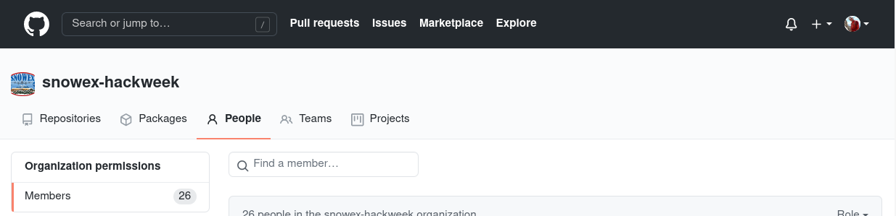

<<<<<<< HEAD
# GitHub Account

## What is Git/GitHub?

[Git](https://git-scm.com/) is a popular version control system that is the foundation of most open source software development. You are not required to know Git in advance of this event, but come prepared to learn a lot about it! [GitHub](https://github.com) is a hosting service for Git repositories, enabling us to share code across teams in a web environment.  

## What if I do not have the `git` command on my local machine?

If you don't have Git installed on you local machine, you can download the latest installer on [Git-SCM](https://git-scm.com). More help for the install process can be found in the [official Git documentation](https://git-scm.com/book/en/v2/Getting-Started-Installing-Git)
=======
# GitHub

## What is GitHub?
[GitHub](https://github.com) is a hosting service for {term}`Git` repositories,
enabling us to share code across teams in a web environment.
>>>>>>> 5513cf672a39ad9402e029bb2082c497a5c870b3

## Why do I need a GitHub account?

There are three reasons you are required to have a GitHub account for the hackweek:

<<<<<<< HEAD
1. We use GitHub credentialing to give everyone access to our cloud computing resources
2. All of our tutorials and project work will be shared on GitHub
3. You will want a GitHub account to practice everything you'll be learning during the Git/GitHub tutorials

So, if you don't already have a GitHub account, just navigate to [GitHub](https://github.com/):


Then, click on the big green button and then answer a few required questions. Be sure to save your password somewhere safe because you will need it later!

## Why are we joining a GitHub Organization?

GitHub organizations are a convenient way for teams to get all content relevant to a specific project our workshop into one place. By having everything in one central location you will spend less time searching for hackweek content. GitHub organizations have 'teams' that offer simple ways to provide repository access to groups of people, rather than individuals.

We have created a GitHub organization called [{{ hackweek }}]({{ github_org_url}}). For security purposes you can only join the organization by invitation. Here are the steps:

1. Once you have a GitHub ID, send an email to [{{ contact_email }}](mailto:{{ contact_email }}).
2. We will then find your ID on GitHub and send you an invitation to our organization, which should generate an email notification to the email you provided when you signed up for GitHub.
3. Follow the links in the email to accept the invitation.

## How should I configure my GitHub account?

As you'll learn in the next lesson, we will use the [{{ hackweek }}]({{ github_org_url}}) GitHub organization as a way to manage access to our cloud computing resources. In order for this to work each person must have public, rather than private membership in the ICESat-2hackweek organization.

First, navigate to the "People" tab on the [{{ hackweek }}]({{ github_org_url}}) GitHub organization and find yourself:


=======
1. Your GitHub accounts will give you access to the hackweek cloud computing resources
2. All hackweek tutorials will be shared on GitHub
3. All project teams will use GitHub to collaborate and work together on their code

## Creating a GitHub account

Go to [GitHub](https://github.com/).


Next, enter your email address and click on the green 'Sing up for GitHub' button.
You will need to answer a few required questions in the following dialogs.
Be sure to save your password somewhere safe because you will need it later!

## Why are you joining the SnowEx Hackweek GitHub Organization?

GitHub organizations are a way for teams to manage many repositories
specific to a project or workshop in one place. For the hackweek, having
an organization creates a central location to access all hackweek content.
GitHub organizations also have 'teams' that offer simple ways to provide repository
access to groups of people, rather than individuals.

We have created a {{ hackweek }} GitHub organization ({{ github_org_url}}).
For security purposes you can only join the organization by invitation.
Here are the steps:

1. If you confirmed participation in the hackweek you will receive an email notification to the email you provided when you signed up for GitHub.
1. Follow the link in the email to accept the invitation.

(configure-github)=

## How should I configure my GitHub account?

As you'll learn in the next lesson, we will use the {{ hackweek }} GitHub
organization as a way to manage access to our cloud computing resources.

```{attention}
You must have *Public*, rather than *Private* organization membership (GitHub's default),
in order for our JupyterHub authentication to work. For events like hackweeks,
public membership also helps so that others can recognize your participation in the event!
```

First, navigate to the "People" tab on the {{ hackweek }} GitHub organization
({{ github_org_url }}) and find yourself:


>>>>>>> 5513cf672a39ad9402e029bb2082c497a5c870b3

Now, if you see "Private" to the right of your account, you will need to switch this to "Public":


The steps for doing this are also well documented on [this](https://help.github.com/en/articles/publicizing-or-hiding-organization-membership) GitHub help page.

## How will GitHub repositories be structured?

<<<<<<< HEAD
When you click on the "Repositories" tab in the [{{ hackweek }}]({{ github_org_url}}) GitHub Organization you will see a list of names, each of which links to a separate GitHub repository:


Each repository is a container for a specific subset of material for this event. For example, we have a separate repository for each tutorial. There is a repository for the public-facing website you used to register for this event, and a repository for the wiki page. We'll also create new repositories for each project when we meet in person.
=======
When you click on the "Repositories" tab in the {{ '[GitHub organization]({url})'.format(url=github_org_url) }}  you will see a list of names, each of which links to a separate GitHub repository:


Each repository is a container for a specific subset of material for this event. For example, there is a repository for the public-facing website you used to register for this event https://github.com/snowex-hackweek/website. We'll also create new repositories for each project.
>>>>>>> 5513cf672a39ad9402e029bb2082c497a5c870b3
