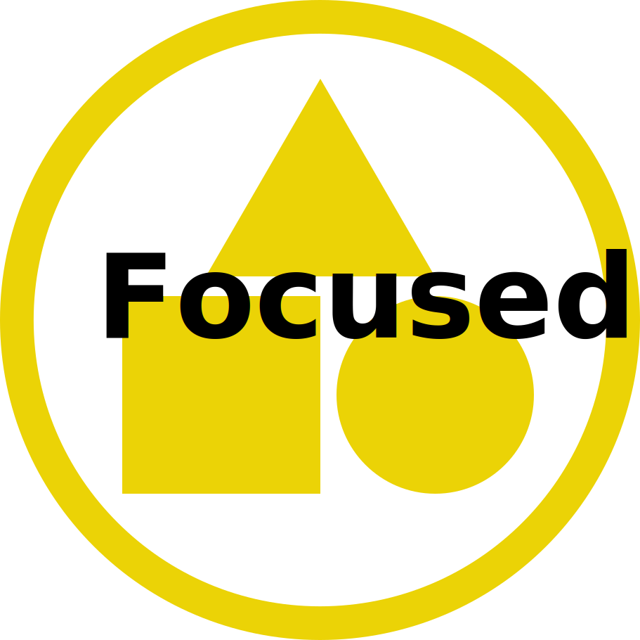

# Projects

During our hackweeks, we invite participants to collaborate in small group project teams (usually 5-7 people). Depending on the size of the hackweek, we usually see between 10-15 project teams form. Embedding project work along with tutorials across the week offers participants multiple ways to deepen their learning around specific data sets, data science methods, and open science practices.

Each hackweek’s community of research scientists and domain practitioners generates the project offerings. While the projects are unique from hackweek to hackweek, they typically fall into one of the following categories:

* **Advancing a part of a research idea or ongoing effort**
* **Deepening tutorial learning with hands-on experience with data sets/tools**
* **Developing a new community tool or library**

```{image} ../img/projects-montage.png
:alt: picture of people interacting during hackweek project work
:class: bg-primary mb-1
:width: 700px
:align: center
```

## How projects are designed

On the following pages, you will find more details on how projects are designed. This information is provided to help guide project leaders, but it is also useful for all hackweek participants to be familiar with. 

We encourage all project leaders to be creative with their ideas when planning out the project’s group work and learning opportunities. **The hackweek organizers will help project leaders think through how to best scope their projects to match their desired outcomes for the group work.** In the meantime, project leaders can consider the range of scoping options described in the table below to get a sense of where their ideas may fall.

On the left, the project is less structured so that it can be adapted to where team members would like to take the project based on what they can contribute and want to learn. On the right, the project work is much more structured allowing participants to make quick progress on project goals and/or focused learning experiences. **Most projects will fit somewhere in between, a blend of focused, structured, and adaptable.**

| |  |  |
| --- | --- | --- |
| **Scope** | <ul><li>Your team explores a variety of aspects with a new data set, tool, or method</li></ul>  | <ul><li>Your team works to develop a specific software tool or answer a specific research question</li></ul> |
| **Preparation** | <ul><li>Project leaders provide example data, code, and tutorial-like content | <ul><li>Project leaders provide well-defined and measureable goals</li></ul>  |
| **Teamwork** | <ul><li>Team members can pursue their own specific learning goals within the broad project topic</li> <li>Project leaders spend more time teaching and guiding team members through the project topic</li></ul>  |  <ul><li>Team members work on specific tasks to accomplish project goals</li> <li>Project leaders spend more time coordinating specific tasks and lead design discussions</li></ul> |

## Project Timeline

Each project will progress through these stages:

```{image} ../img/project-timeline.png
:alt: flowchart of typical hackweek project timelines
:class: bg-primary mb-1
:width: 800px
:align: center
```

### [Project ideation and team formation](project_before.md)

Though project ideation begins well before the hackweek event, it is expected that the process is ongoing and iterative, and will continue through the event itself with input from participants helping to shape or adapt project goals.

### [Project teamwork](project_during.md)

During the hackweek, participants will spend time with tutorials and with project work. We have provided suggested outlines for daily check-in meetings and tasks that a project leader can guide their team through.

### [Communities of practice](project_after.md)

We aspire to keep projects going after the hackweek! This is an optional (yet ideal) outcome of hackweek project work.
