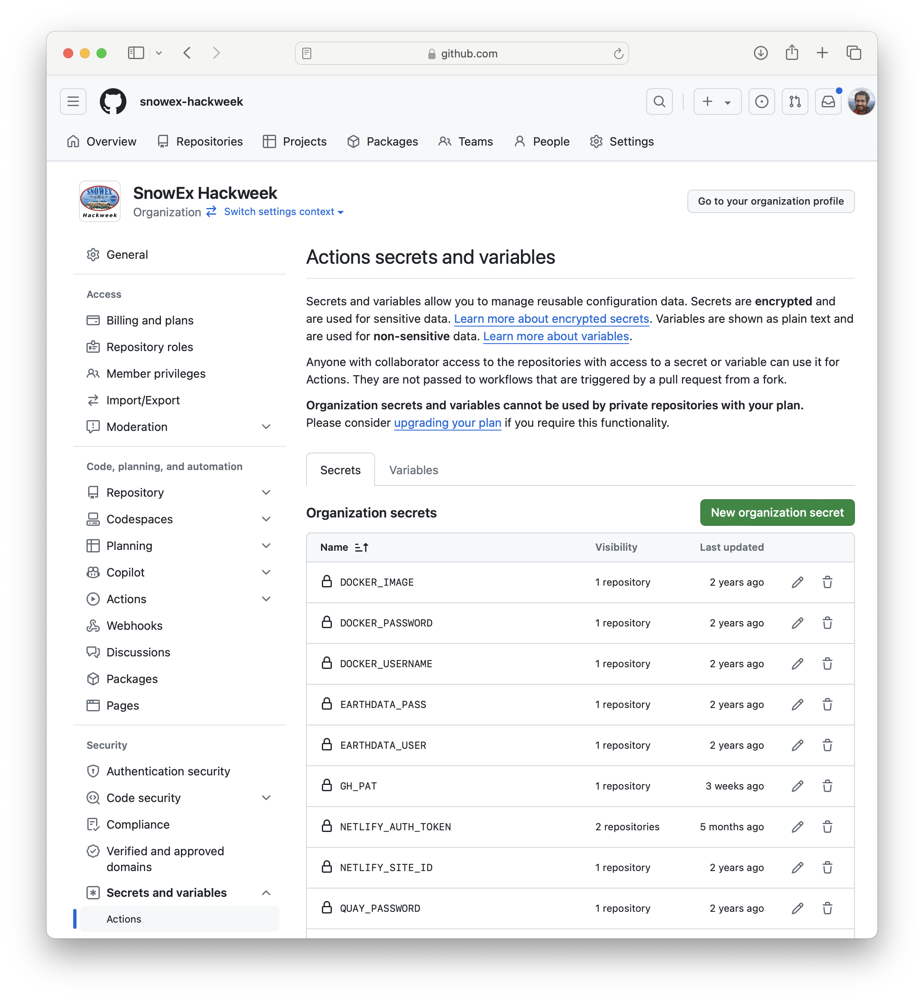

# GitHub Setup

## GitHub Organization

We recommend that each hackweek creates a [GitHub Organization](https://docs.github.com/en/organizations/collaborating-with-groups-in-organizations/about-organizations) to manage various repositories for an event. This makes organizing teams of users easy and consolidates content such as project work and tutorials for easier discoverability. It also allows managing secrets and making them available to different repositories if necessary.

## Hackweek Bots

For NASA-focused hackweeks we created a "bot" user with a Gmail account, GitHub Account https://github.com/hackweek-admin, and NASA Earthdata login (https://urs.earthdata.nasa.gov) to allow GitHub Actions workflows to access NASA Data with a set of credentials that do not belong to any individual.

## GitHub Actions Secrets

We can add credentials as ["Organization Secrets"](https://docs.github.com/en/actions/security-guides/using-secrets-in-github-actions) and make them available to only select repositories that need them. For example see the screenshots below on giving the `EARTHDATA_PASS` secret to a specific repository

1. ### Repository secrets are under `Settings` -> `Secrets and variables` 
  
   For example, replace `snowex-hackweek/website-2024` for your repository in the following URL: https://github.com/snowex-hackweek/website-2024/settings/secrets/actions  

   **only people with `admin` access to a repository can access these settings**

   

1. ### Select `Manage organization secrets`. 

   You can either create a new one, or click the "pencil" icon of an existing one to give access to a new repository

   