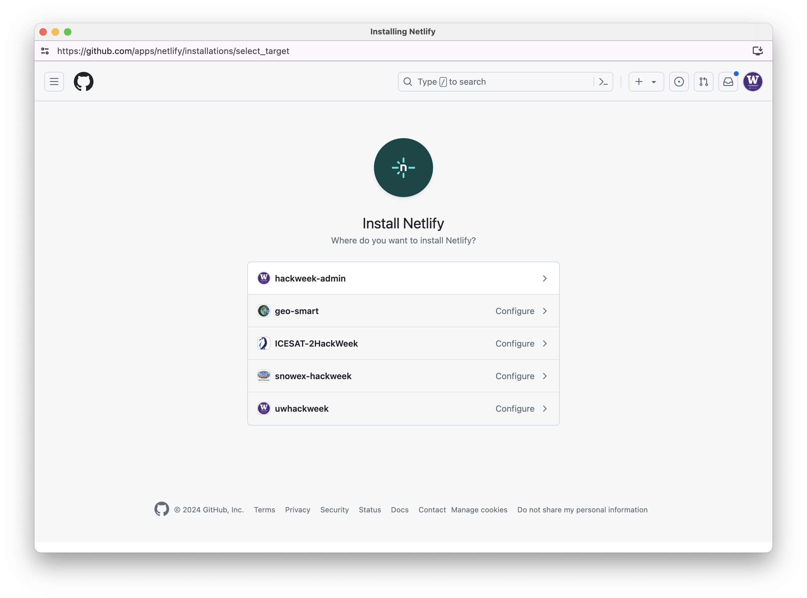
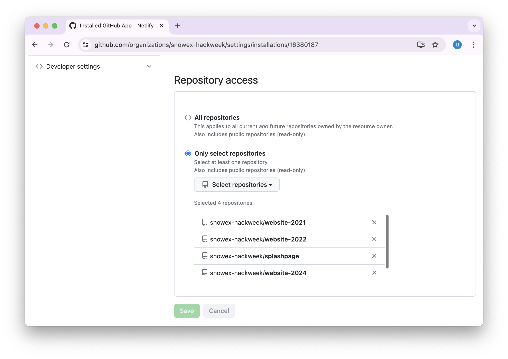
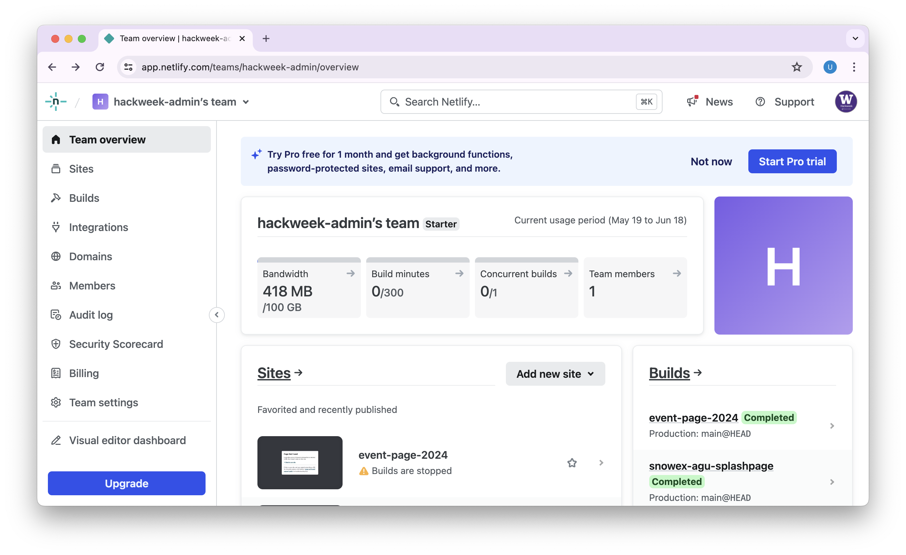
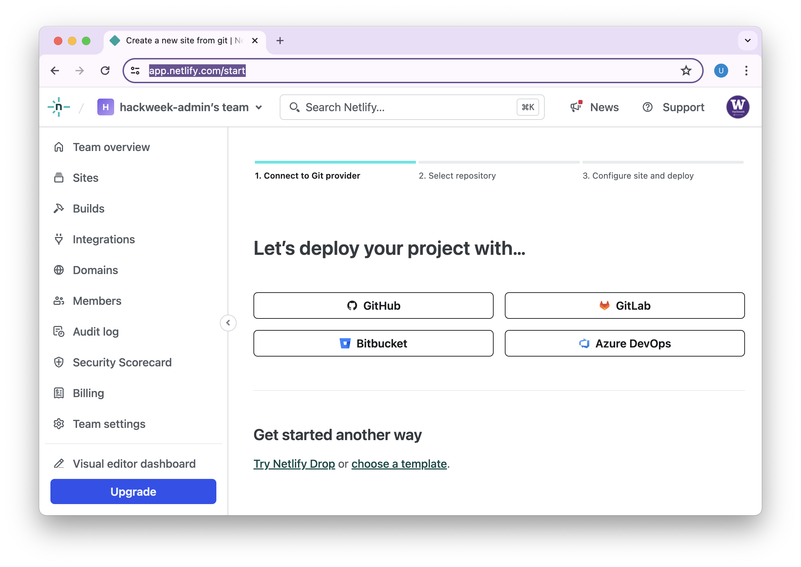
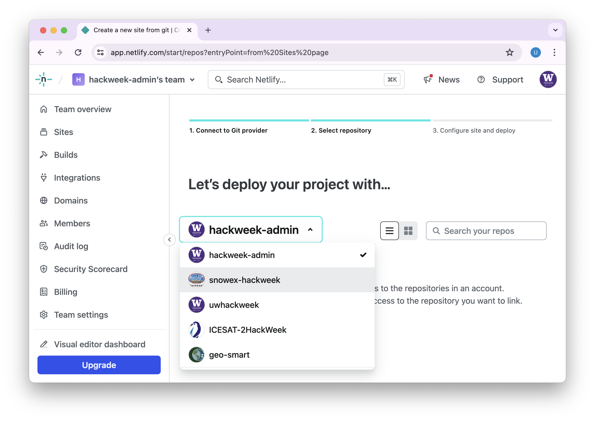
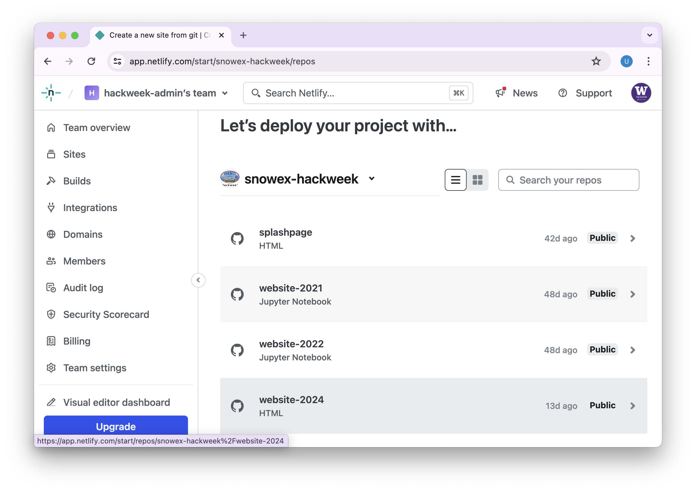
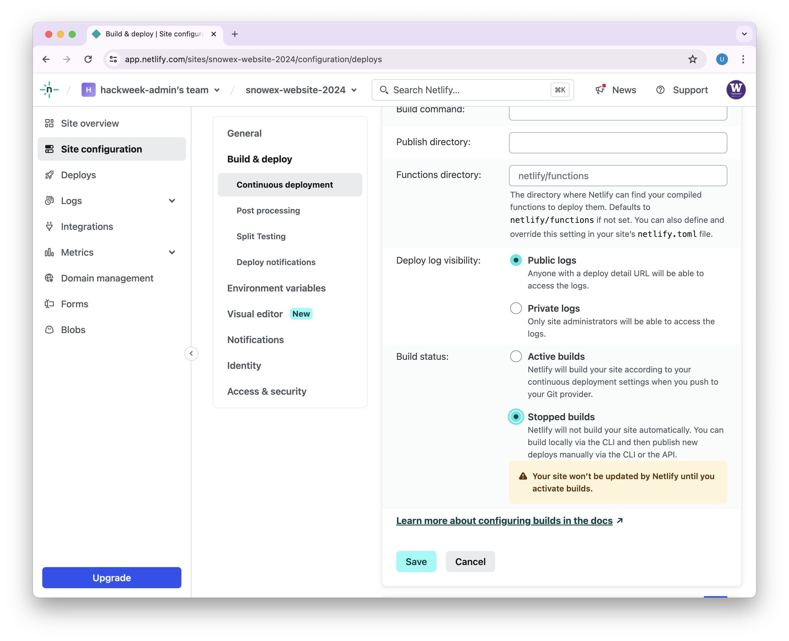
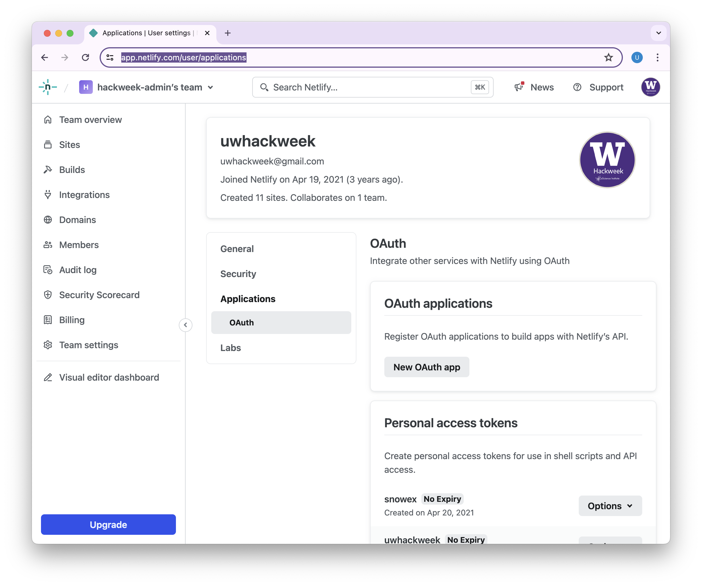
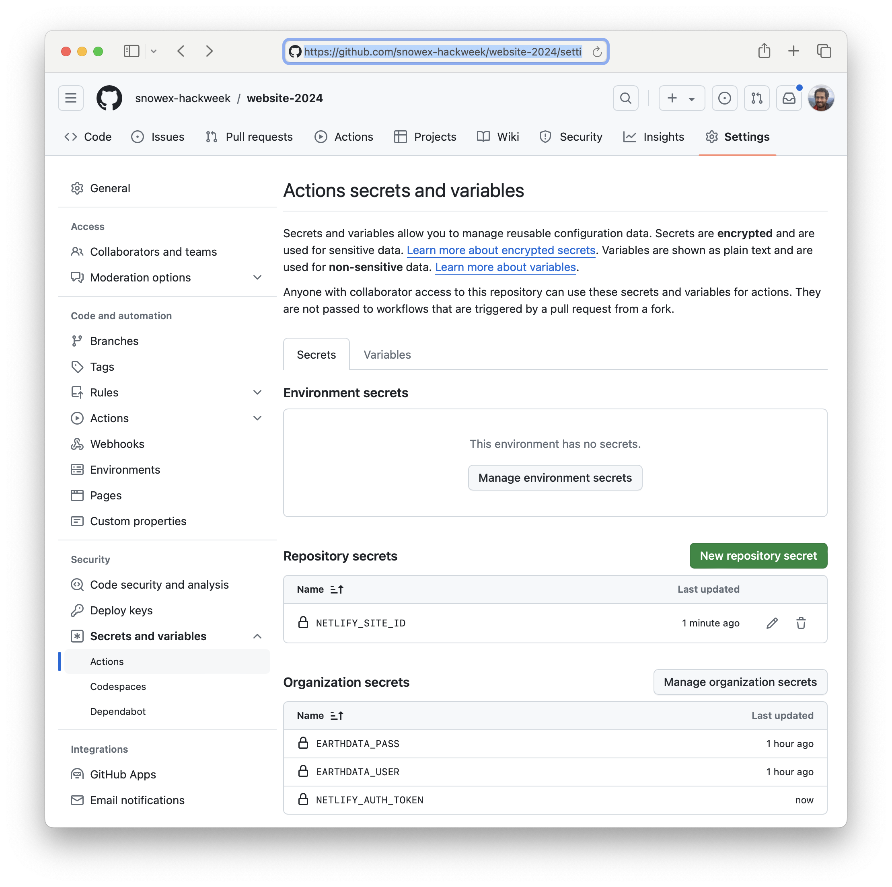

# Configuring Netlify for pull request previews

Public websites for hackweeks have content contributed by many different people, and we want to ensure that they are well-formatted and functional at all times. In order to do this, we "preview" changes to a website to confirm it all looks good before merging new content. There are different ways to accomplish this, but we have found that [Netlify](https://www.netlify.com) is free and works well for previews. 

## Link Netlify to a repository

Netlify organizes websites by "Site" which is tied to a specific GitHub repository. *All preview links created are persistent and public but not indexed by search engines.* If you want to delete them, you can delete the 'Site' from Netlify. Importantly, the Netlify previews are completely decoupled from the main website that is hosted by GitHub Pages, so you do not need to worry about overwriting or losing your main event webpage!

1. ### Make sure the Netlify App is installed for your organization

   Go to https://github.com/apps/netlify/installations/select_target or visit GitHub Org settings for GitHub Apps (e.g. https://github.com/organizations/snowex-hackweek/settings/installations):

   

   Under 'Configure' for Netlify you can select which repositories Netlify has access to: 

   

1. ### Log into Netlify and 'Add new site'

   

1. ### Select import an existing project

1. ### Select deploy project with GitHub

   

1. ### Select correct GitHub Organization for website repo

   

1. ### Select correct repository based on this template (e.g. website-2024)

   

   For 'Site name' enter something informative like `snowex-website-2024` and click 'Deploy'

1. ### Disable netlify main deployment

   Important!! We only want to use Netlify for *Previews* so under 'Site Configuration' -> 'Build & Deploy' -> 'Continuous deployment' -> 'Build settings' -> 'Configure' -> select "Stopped Builds" -> Save
   (e.g. https://app.netlify.com/sites/snowex-website-2024/configuration/deploys)

   If you do not do this, you will have a public mirror of your website available at your netlify site name (https://snowex-website-2024.netlify.app)

   

1. ### Copy unique NETLIFY_SITE_ID to use in GitHub Actions Workflows

   Copy the "Site ID" token string under "Site Details", it will look something like this "f9235abc-688d-45e4-8f62-5519ghi455j1"

   (e.g. https://app.netlify.com/sites/snowex-website-2024/configuration/general)

1. ### Create a NETLIFY_AUTH_TOKEN to use in GitHub Actions workflows

   Go to https://app.netlify.com/user/applications and under 'Personal access token' create a new token with optional expiration. It will look something like this `nfp_8abcUxd2ESPs9yEegb3ATSBst13JicvY135s`

   

1. ### Add GitHub Action Secrets to your repository

   In the end, a website repository needs to have access to both `NETLIFY_AUTH_TOKEN` and a specific `NETLIFY_SITE_ID` for the preview workflow to function:

   

   In your website repository, go to 'Settings' -> 'Secrets and variables' -> 'Actions' -> 'New repository secret' . Make one for `NETLIFY_SITE_ID` and `NETLIFY_AUTH_TOKEN` with the codes copied in the previous two steps.

1. ### Ensure that the workflow has permission to write issue comments

  

  In your website repository, go to 'Settings' -> 'Actions' -> 'General' and scroll to the section on workflow permissions. Make sure sure that the workflow has read/write permissions. By default, this will be disabled at the organization level, so if the read/write is greyed out, you will need to have a GitHub organization admin change the org level permissions. To do this, go to the GitHub organization then 'Settings' -> 'Actions' -> 'General' and scroll to the section on workflow permissions.

1. ### Trigger your first deploy

   Edit a file in GitHub, Commit and create a pull-request. Label the pull request 'preview'. You will need to create the 'preview' label the first time. Once you create the PR with label 'preview', the Netlify workflow will be triggers and when finished a link to a preview of the website will appear in the PR comments.

